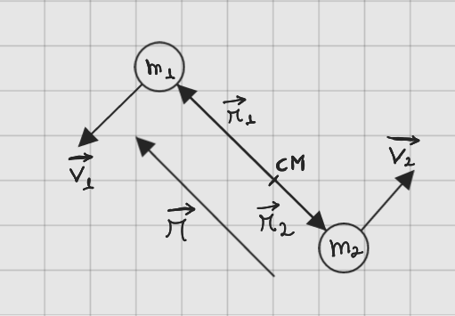
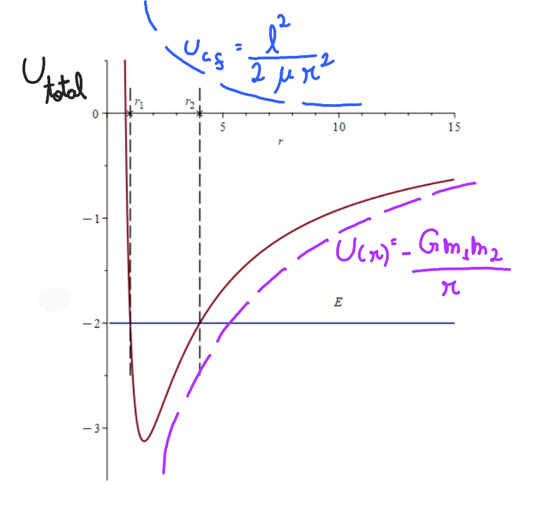

<!-- MathJax script

-->
# Gravitação
## O problema de dois corpos sob a ação de uma força central
  Um sistema de dois corpos é um modelo teórico em que dois objetos interagem exclusivamente sob a influência de forças mútuas, como a gravidade. Nesse contexto, o centro de massa desempenha um papel crucial: ele é o ponto onde o momento total do sistema é conservado, e ambos os corpos orbitam ao seu redor. Em muitos casos, especialmente em sistemas isolados, assume-se que o momento angular total em relação ao centro de massa é constante. Isso significa que, se o momento angular inicial é zero, os corpos se moverão de maneira a preservar essa condição. Além disso, a energia total do sistema é a soma das energias cinética e potencial gravitacional, e sua conservação determina as possíveis trajetórias. A interação entre essas energias define se o movimento é uma órbita fechada (elipse ou círculo), aberta (parábola ou hipérbole), ou mesmo uma colisão direta. Esses princípios fornecem a base para compreender a dinâmica em sistemas gravitacionais, ajudando a prever as configurações e comportamentos possíveis.
### Sistema com dois corpos
  Inicialmente, estudaremos o movimento entre os dois corpos como partículas, pois para descrever a trajetória, a composição interna dos corpos não é relevante para o movimento, logo será estudando como o movimento de uma párticula sujeita a uma força central. Essas forças de interação, são forças centrais e conservativas.
  

 
 A partir do desenho e da Lei da Gravitação Universal de Newton, obtém-se o módulo da força que 2 sofre por causa da presença de 1 ( $\vec{F_{21}}$ ), e a direção será dada por esse valor absoluto vezes a direção unitária, dada pelo vetor $|\vec{r_2} - \vec{r_1}|$ pelo seu módulo, sendo que sua direção é contrária a força, por isso sinal é negativo.

  

  $$
  \begin{aligned}
  \left| \vec{F_{21}} \right| &= \frac{G m_1 m_2}{|\vec{r_2} - \vec{r_1}|^2} \\
  \vec{F_{21}} &= \frac{G m_1 m_2}{|\vec{r_2} - \vec{r_1}|^3} \left( |\vec{r_2} - \vec{r_1}| \right)
  \end{aligned}
  $$

  Tendo em vista que a força é conservativa, ela poderia ter sido obtida através da energia potencial, dada por:

  $$ 
 \begin{align}
 U(|\vec{r_2} - \vec{r_1}|) &= -G\frac{m_1 m_2}{|\vec{r_2} - \vec{r_1}|}
 \end{align}
 $$
 

Cabe destacar que a energia potencial depende apenas do módulo da diferença entre os vetores de posição. Isso significa que, se mudássemos a origem, os vetores de posição mudariam, mas o módulo da diferença entre eles continuaria o mesmo. Portanto, a energia potencial e a força não seriam afetadas por essa mudança de origem. Outro caso é uma possível translação do sistema para outro local, somando a $\vec{r_1}$ e $\vec{r_2}$ um vetor fixo. Nesse caso, os vetores de posição mudariam, mas a diferença entre eles permaneceria a mesma, pois a translação não afeta a distância relativa entre os corpos (sistema invariante por translação).

Coordenada relativa é definida como:
 

 $$ 
 \begin{align}
 \vec{r} &= \vec{r_1} - \vec{r_2} \\
  r &= \left| \vec{r} \right|
\end{align}
 $$
 
Assim, como conhecemos a energia potencial associada ao problema, podemos tomar a lagrangiana associada a ele, buscando conhecer a descrição desse sistema a partir das energia cinética, $E_c$ , e potencial ( $U$ ):

$$ 
\begin{align}
 L &= E_c - U &= \frac{1}{2}m_1\dot{\vec{r_1}}^2 + \frac{1}{2}m_2\dot{\vec{r_2}}^2 - U(r)
\end{align}
$$
  
Além disso, usaremos o vetor posição do centro de massa dado por:

$$ 
\begin{align}
\vec{R} &= \frac{\vec{r_1}m_1 + \vec{r_2}m_2}{m_1 + m_2} 
\end{align}
$$

Buscaremos simplificar essa equação, visando retirar as redundâncias e deixarmos tudo em termos de r e $\vec{R}$, para isso, chamaremos $m_1$ + $m_2$ = $M$, e juntaremos a equação da coordenada relativa com a equação do vetor posição do centro de massa, de forma a deixar os vetores $\vec{r_1}$ e $\vec{r_2}$ em função de $\vec{r}$ e $\vec{R}$. Para isso, multiplica-se a equação da coordenada relativa por $\frac{m_2}{M}$ e somado a equação da posição do centro de massa.

$$ 
\begin{align}
\vec{r}\frac{m_2}{M} &= \vec{r_1}\frac{m_2}{M} - \vec{r_2}\frac{m_2}{M} \\
\vec{R} &= \frac{\vec{r_1}m_1}{M} + \frac{\vec{r_2}m_2}{M} \\
\vec{r}\frac{m_2}{M} + \vec{R} &= \vec{r_1}\frac{m_2}{M} + \frac{\vec{r_1}m_1}{M} \\
\vec{r_1} &= \vec{r}\frac{m_2}{M} + \vec{R}
\end{align}
$$

Analogamente poderemos manipular as equações para obter $r_2$, que será dado por:

$$ 
\begin{align}
\vec{r_2} &= \vec{R} - \vec{r}\frac{m_1}{M} 
\end{align}
$$

Para substituir na equação é necessário calcular $\dot{\vec{r_1}}$ e $\dot{\vec{r_2}}$:

$$ 
\begin{align}
\vec{r_1} &= \vec{r}\frac{m_2}{M} + \vec{R} \to \dot{\vec{r_1}} &= \dot{\vec{r}}\frac{m_2}{M} + \dot{\vec{R}} \\ 
\vec{r_2} &= \vec{R} - \vec{r}\frac{m_1}{M} \to \dot{\vec{r_2}} &= \dot{\vec{R}} - \dot{\vec{r}}\frac{m_1}{M} 
\end{align}
$$

Substituindo na equação da lagrangiana

$$ 
\begin{align}
L &= \frac{1}{2} m_1 \left( \dot{\vec{r}} + \frac{m_2}{M} \dot{\vec{R}} \right)^2 + \frac{1}{2} m_2 \left( \dot{\vec{R}} - \frac{m_1}{M} \dot{\vec{r}} \right)^2 - U(r)
\end{align}
$$

Após feito os cálculos, ficaremos com

$$ 
\begin{align}
L &= \frac{1}{2} M \dot{\vec{R}}^2 + \frac{1}{2} \frac{m_1 + m_2}{M} \dot{\vec{r}}^2 - U(r)
\end{align}
$$

Com esse resultado, obtemos que a trajetória depende apenas da coordenada do centro de masssa e da coordenada da posição relativa. No entanto, aparece um objeto novo, $\frac{m_1 + m_2}{M}$, com dimensão de massa. Tal resultado é esperado, tendo em vista que esse termo deve ter relação com o termo ligado ao $\dot{\vec{R}}$, pois são termos de dimensão de energia cinética( massa vezes o quadrado da velocidade ). Esse objeto ganha o nome de massa reduzida de um sistema de dois corpos definido por $\mu = \frac{m_1 m_2}{m_1 + m_2}$. Uma forma mnemônico dessa expressão é dada por  $\frac{1}{\mu} = \frac{1}{m_1} + \frac{1}{m_2}$. A massa reduzida tem um papel muito importante para o estudo das órbitas, pois em casos como Sol e Terra, onde um corpo possui uma massa muito grande em relação ao outro, uma das frações tendem a um número muito pequeno em relação ao outro, podendo assim, ser descartado. Portanto adotamos a lagrangiana como:

$$ 
\begin{align}
L &= \frac{1}{2} M \dot{\vec{R}}^2 + \frac{1}{2} \mu \dot{\vec{r}}^2 - U(r)
\end{align}
$$

### Aonde está contida a trajetória?

Tendo em vista que a equação não depende de $\vec{R}$, apenas depende de $\dot{\vec{R}}$, portanto, essa coordenada é cíclica( ignorável ), tendo uma lei de conservação associada a essa coordenda sobre o momento total do sistema, logo o momento total do sistema é conservado. Outra conclusão é que podemos imaginar essa equação como compostas por duas partes, uma dependente da coordenada $\dot{\vec{R}}$ e a outra só dependendo de $\vec{r}$ e $\dot{\vec{r}}$, ou seja, mostra-nos que temos dois problemas separáveis, distintos e independentes. Bom, como a R é coordenada ignorável, significa que $M\ddot{\vec{R}} = 0$ e isso está associado ao fato de um sistema isolado, que só depende de forças externas e como não há forças externas, logo, seu momento associado ao centro de massa é constante, por consequência, $M\dot{\vec{R}} = constante$ ( momento total do sistema ), velocidade do centro de massa é uma constante do movimento, ou seja, centro de massa executa um movimento uniforme.
 Analisando, a equação de movimento para coordenada relativa. Toma-se a derivada de L em relação a posição, denotada por $q_i$, e como é um vetor, significa tomar o seu gradiente dessa função escalar, e menos resultado, obtém-se a força.

$$ 
\begin{align}
\frac{\partial L}{\partial q_i} &= \frac{d}{dt} \left( \frac{\partial L}{\partial \dot{q}_i} \right) \\
\frac{\partial L}{\partial \vec{r}} &= \frac{d}{dt} \left( \frac{\partial L}{\partial \dot{\vec{r}}} \right)\\
\- \nabla U(r) &= \mu \ddot{\vec{r}}
\end{align}
$$

Essa equação é uma forma de visualizar a segunda lei de newton, com a força que age sobre uma partícula fictícia e é igualada a massa dessa particula vezes sua aceleração. Tais conclusões e resoluções sobre objetos inexistentes servem para que quando obtivermos as soluções para R e r, podermos obter $r_1$ e $r_2$, e para alguns casos, isso não importa, pois vendo o caso Terra e Sol, o centro de massa ficara dentro do sol, de forma que o movimento que buscamos, a órbita da Terra, é descrita aproxidamente pelo r, tendo em vista que o sol vai ter um movimento mínimo, podendo ser ignorado. Portanto, adotaremos um referencial com origem no centro de massa do sistema. Como o centro de massa se move com velocidade constante em relação a um referencial inercial (na ausência de forças externas), esse novo referencial também será inercial. Dessa forma, com o referencial no centro de massa, ignorando o movimento do centro de massa, e quando ele coincide com a partícula mais massiva, o problema foi reduzido a um problema de apenas uma partícula, assim usaremos ferramentas de problemas unidimensionais.

Nesse novo referencial, o momento total é zero, assim dado um movimento em $m_1$, $m_2$ terá movimento na mesma direção, porém em sentido contrário com velocidade menor, dado um $m_2$ > $m_1$. Reescrevendo as coordenadas na nova origem(sendo $\vec{R} = \vec{0}$), temos:

$$
\begin{align}
\vec{r_1} &= \vec{r}\frac{m_2}{M} \\
\vec{r_2} &= \- \vec{r}\frac{m_1}{M} 
\end{align}
$$

Lembrando que o sistema é isolado, então o momento angular total será conservado, pois não há forças externas e o torque externo é 0. Escrevendo o momento angular($\vec{L}$):

$$
\begin{align}
\vec{L} &= \vec{r_1} \times \vec{p_1} + \vec{r_2} \times \vec{p_2} \\
\vec{L} &= m_1\vec{r_1} \times \dot{\vec{r_1}} + m_2\vec{r_2} \times \dot{\vec{r_2}}
\end{align}
$$

Calculando para o centro de massa e deixando a equação em termos de r:

$$
\begin{align}
\vec{L} &= m_1\left(\frac{m_2}{M} \right)^2 \times \dot{\vec{r}} + m_2\left(\frac{m_1}{M} \right)^2 \times \dot{\vec{r}} \\
\vec{L} &= \frac{m_1 m_2}{M} \vec{r} \times \dot{\vec{r}} &= \vec{r} \times \mu \dot{\vec{r}}
\end{align}
$$

Tal resultado remete ao momento angular de uma partícula, que é o produto do vetor posição pelo vetor momento associado a ele, sendo a massa pela derivada do vetor posição, sendo a massa representada pela massa reduzida. Bom, como o momento angular total é uma quantidade conservada, a direção do momento angular é fixa, assim, o movimento dessa partícula ficticia se da em uma plano que é perpendicular a esse momento angular, assim, como a coordenada relativa está associada a essa partícula, isso significa que vetor vai trafegar em um plano perpendicular ao momento angular.

### Trajetória plana e novo sistema de coordenadas

Logo, a primeira consequência da Lei da Gravitação Universal é que o movimento planetário é um movimento plano, assim, só é preciso duas coordenadas escalares para determinar o vetor coordenada relativa, que será medida a partir de um centro de massa, que para o sistema planetária, irá estar associada a distância do planeta ao Sol. Dessa forma, serão adotadas coordenadas polares bidimensionais. Portanto, iremos, inicialmente, escrever os termos da energia cinética nesse novo sistema de coordenadas dado por:

$$
\begin{align}
\hat{r} &= \cos\phi \, \hat{i} + \sin\phi \, \hat{j}, \quad \\
\hat{\phi} &= -\sin\phi \, \hat{i} + \cos\phi \, \hat{j}.
\end{align}
$$
 Assim, substituindo os termos teremos:
$$
\begin{align}
\vec{r} &= r\hat{r} \\
\dot{\vec{r}} &= \dot{r}\hat{r} + r\dot{\hat{r}} = \dot{r}\hat{r} + r\dot{\phi}\hat{\phi} \\
\dot{\vec{r}}^2 &= \dot{r}^2 + r^2{\dot{\phi}}^2 \\
L_{rel} &= \frac{1}{2} \mu \left(\dot{r}^2 + r^2{\dot{\phi}}^2 \right) - U(r) \\
\end{align}
$$

Analisando o resultado da equação, temos que ela não depende de $\phi$, sendo uma coordenada ignorável, e dessa forma, temos uma lei de conservação. Então analisando esse fato, que está associado a:

$$ 
\begin{align}
\frac{\partial L}{\partial q_i} &= \frac{d}{dt} \left( \frac{\partial L}{\partial \dot{q}_i} \right) \\
\frac{\partial L}{\partial \dot{\phi}} &= \mu r^2 \dot{\phi} &= constante &= l \\
\dot{\phi} &= \frac{l}{\mu r^2}
\end{align}
$$

Sendo que nesse caso, que está assumindo papel de $q_i$ é o $\phi$, e não tem dependencia em $\phi$, logo a derivada do lado esquerdo é zero, logo a quantidade da direita da equação é uma quantidade conservada. Tal expressão possui dimensão de momento angular, tendo em vista o produto do momento de inércia de $\mu r^2$ pela velocidade angular $\dot{\phi}$, dando o momento angular da partícula ficticia que é conservado. Dessa forma, isola-se a velocidade angular, obtém-se que quanto maior a distancia, menor é a velocidade angular. Agora, vamos obter a equação para a coordenada radial, achando a força generalizada e a taxa de variação temporal do momento generalizado, igualando-as, note que $\phi$ aparecerá na equação mas usaremos a relação encontrada anteriormente.

$$ 
\begin{align}
\frac{\partial L}{\partial r} &= \mu r \dot{\phi}^2 - \frac{\partial U}{\partial r} \\
\frac{\partial L}{\partial \dot{r}} &= \mu \dot{r} \\
\dot{\phi} &= \frac{l}{\mu r^2} \\
\mu r \frac{l^2}{\mu^2 r^4} - \frac{\partial U}{\partial r} &= \mu \ddot{r} \\
\dot{\frac{l^2}{\mu r^3}} - \frac{\partial U}{\partial r} &= \mu \ddot{r}
\end{align}
$$

Deparamo-nos com um termo associado à força generalizada que representa a força centrífuga. Esta força, embora seja considerada fictícia, desempenha um papel fundamental na descrição do movimento de corpos em sistemas não-inerciais ou com movimento circular.
A força centrífuga surge como um termo de compensação no equilíbrio dinâmico, sempre positivo, que tende a afastar a partícula do centro de rotação. É importante ressaltar que essa força não é uma força real no sentido físico tradicional, mas sim um artifício matemático que surge das equações de movimento quando descritas em um referencial rotativo.
Sua natureza matemática permite que possamos associar a ela uma energia potencial efetiva. Ao integrarmos a expressão correspondente, podemos estabelecer uma relação energética que captura o comportamento dinâmico do sistema.

$$ 
\begin{align}
U_{cf} &= \displaystyle\int \frac{l^2}{\mu r^3} &= \frac{l^2}{2\mu r^2} \\
U_{total} &= U + U_{cf} &= U(r) + \frac{l^2}{2\mu r^2}
\end{align}
$$

Dessa forma, possuímos um problema de dois corpos sujeitos a uma força central, travestido ao problema de uma partícula em uma dimensão, com massa reduzida(ficticia), e essa dimensão única é uma quantidade escalar que é a distância entre as duas partículas que compunham o problema original, e dessa forma, pode-se utiklizar ferramentas de método unidimensionais.

Exemplo do gráfico da energia para sistema gravitacional:

$$ 
\begin{align}
U_{cf} &= \frac{l^2}{2\mu r^2} \\
U(r) &= \- \frac{G m_1 m_2}{r}
\end{align}
$$

### Energia potencial efetiva

No começo a parcela positiva domina, pois sobe mais depressa, já no final, a parcela negativa que domina, pois se aproxima do zero mais lentamente, dando esse resultado acima. Dessa forma, nosso problema se resume a analisar o percurso de uma partícula de massa \$mu$ que se move sujeita a ação dessa energia potencial. 
 A análise do gráfico de energia potencial permite determinar se as trajetórias de uma partícula são fechadas ou abertas com base na energia total do sistema. Para trajetórias fechadas, a energia é menor que a energia de escape, confinando a partícula em uma região finita. Para trajetórias abertas, a energia é suficiente para a partícula escapar e se mover indefinidamente, seguindo uma trajetória não restrita. Cabe destacar que no ponto de mínimo da função, a trajetória é uma circunferência.

Provando o resultado anterior, garantindo a conservação da energia:

$$ 
\begin{align}
\mu \ddot{r} &= \- \frac{d U_{efetivo}}{d r} \\
\mu \frac{d \dot{r}^2}{dt} &= \- \frac{d U_{efetivo}}{d r} \frac{dr}{dt} &= \- \frac{d U_{efetivo}}{d t} \\
\frac{d}{d t} \left( \frac{1}{2} \mu \dot{r}^2 \right) + \frac{d U_{efetivo}}{d t} &= 0 \\
\frac{1}{2} \mu \dot{r}^2 + U_{efetivo} (r) &= constante &= E
\end{align}
$$

Portanto, essa quantidade de energia é conservada( não depende do tempo ), sendo dada pela soma da energia cinética mais o potencial efetivo, que engloba a energia potencial real e a energia potencial centrífuga, que pode ser associada a energia cinética de rotação.

### Segunda lei de kepler
 
 Dessa forma, podemos obter a segunda lei de kepler, dado a figura abaixo:
 
 
 
 Buscamos calcular área dessa figura, aproximando essa curva para um t infinitesimal, teremos uma reta, assim basta calcularmos a área de um triângulo:

 $$ 
\begin{align}
dA &= \frac{1}{2} r(t) r(t + dt) \sin{\phi} \\
dt \to 0 \\
\frac{dA}{dt} &= \frac{1}{2} r(t) r(t + 0) \frac{d\phi}{dt} &= \frac{1}{2} r(t)^2 \dot{\phi}
\end{align}
$$

Assim, obtemos a velocidade areolar, e conforme a segunda lei de Kepler, áreas iguais são percorridas em intervalos de tempos iguais, devemos provar que essa velocidade é constante, assim substituindo $\dot{\phi}$, pela relação encontrada anteriormente, temos:

 $$ 
\begin{align}
\frac{dA}{dt} &= \frac{1}{2} r(t)^2 \frac{l}{\mu r^2}
\frac{dA}{dt} &= \frac{l}{2 \mu}
\end{align}
$$

Portanto, essa velocidade é a razão de duas constantes, ou seja, ela não varia no tempo. Sendo verdadeiro, sempre quando existir uma força central, não apenas para o cenário gravitacional.

### Resolvendo EDO

 Agora, iremos resolver a equação radial, adotando $\- \frac{d U}{dr} = F_g$, faremos um substituição de variável não trivial, mas com esse resultado faremos a nova variável como função do angulo $\phi$, tendo em vista que queremos a forma dessa trajetória, que será dada em função de $\phi$, que será obtida através da regra da cadeia, temos:

 $$ 
\begin{align}
\mu \ddot{r} &=  F + \frac{l^2}{\mu r^3} \\
u &= \frac{1}{r} \\
\frac{dr}{dt} &= \frac{dr}{d \phi} \frac{d \phi}{d t} &= \frac{dr}{d\phi} \dot{\phi} \\
\frac{dr}{dt} &= \frac{l}{\mu r^2} \frac{dr}{d \phi} \therefore \\
\frac{d^2r}{dt^2} &= \left(\frac{l}{\mu r^2}\right) \frac{d^2r}{d \phi^2} \\
r &= \frac{1}{u} \to \frac{dr}{d \phi} \left(\frac{1}{u}\right) &= \- \frac{1}{u^2} \frac{d u}{d \phi} \\
\frac{dr}{dt} &= \frac{l}{\mu r^2} \- \frac{1}{u^2} \frac{d u}{d \phi} &= \frac{dr}{dt} &= \- \frac{-l}{\mu} \frac{du}{d \phi} \\
\frac{d^2r}{dt^2} &= \- (\frac{l u^2}{\mu} \frac{l}{\mu} \frac{d^2u}{d \phi^2} &= \- \frac{l^2u^2}{\mu^2} \frac{d^2u}{d \phi^2} \\
\end{align}
$$

Dessa forma, conseguimos escrever a segunda derivada de r em relação a t, em termos da segunda derivada de u em relação a $\phi$, levando na equação radial( F possui sinal de +, porque é uma força atrativa):

$$
\begin{align}
\- \mu \frac{l^2 u^2}{\mu^2} \frac{d^2 u}{d \phi^2} &= F + \frac{l^2 u^3}{\mu}, \\
u &= u(\phi), \\
\frac{d^2 u}{d \phi^2} &= - \frac{\mu}{l^2 u^2} F - u, \\
F &= - \frac{\gamma}{r^2} = - \gamma u^2, \quad \gamma = \text{constante}, \\
\frac{d^2 u}{d \phi^2} &= - u + \frac{\mu \gamma}{l^2}.
\end{align}
$$

Desse modo, obtemos a equação de um oscilador, pois temos uma constante, que torna a equação não homogenea, ou seja, possui uma força ou pertubação externa do problema. A equação homogenea, seria apenas  $\frac{d^2u}{d \phi^2} + u = 0$, que é a equação de um oscilador harmonico, no entanto, por conta da força externa, temos um oscilador forçado com uma força constante. Note que essa equação é verdade para qualquer força central, dado uma força nula ($F = 0$), tendo $\ddot{u} + u = 0$ e tem como solução $u(\phi) = A \cos{\phi - \delta}$, porém se força é nula, trajetória deveria ser uma reta:

(imagem do sistema e do porque é uma reta)

 Dessa forma, temos que a trajetória de uma linha reta em coordenadas polares dada por:
 
$$
\begin{align}
r(\phi) \cos{\phi - \delta} &= r_0 \\
r(\phi) &= \frac{r_0}{cos{\phi - \delta}}
\end{align}
$$

Bom como $u = \frac{1}{r}$, então $r = \frac{1}{A \cos{\phi - \delta}}$. Dessa forma, mostramos a maneira de como iremos trabalhar com as coordenadas polares para obter o resultado final. Para resolver, faremos uma mudança de variaveis, tal que $v(\phi) = u(\phi) \- \frac{\mu \gamma}{l^2}$, pois ao tomar a derivada, a constante some, e teremos que a derivada de v é igual a derivada de u (isso só é possível porque a força é constante). Assim a equação é dada por:

$$
\begin{align}
\ddot{v(\phi)} + v(\phi) &= 0 \\
\end{align}
$$

Como encontrado nos estudos de osciladores harmônicos, a solução dessa equação diferencial é( adotaremos $\delta = 0$, pois apenas indica onde começaremos a conta o $\phi$):

$$
\begin{align}
v(\phi) &= A \cos{(\phi - \delta)} \\
u(\phi) &= A \cos{(\phi - \delta)} + \frac{\mu \gamma}{l^2} \\
u(\phi) &= A \cos{\phi} + \frac{\mu \gamma}{l^2} = \frac{\gamma \mu}{l^2} \left(1 + \epsilon \cos{\phi}\right) \\
\epsilon &= \frac{A l^2}{\mu \gamma} \\
r(\phi) &= \frac{\frac{l^2}{\gamma \mu}}{1 + \epsilon \cos{\phi}} = \frac{c}{1 + \epsilon \cos{\phi}} \\
c &= \frac{l^2}{\gamma \mu}
\end{align}
$$

Portanto, definimos a equação da órbita, que representa a equação polar de uma cônica( elipses, hiperboles e parábolas ). 

### Análise das trajetórias

Assim, a nossa órbita depende do valor de $\epsilon$, pois se denominador for 0, r vai para o infinito e teremos uma trajetória aberta, caso contrário, teremos uma orbita fechada. Assim, a perguntar a se fazer é $1 + \epsilon cos{\phi} = 0? \to \cos{\phi} = \- \frac{1}{\epsilon}$, para isso iremos analisar os casos em que $\epsilon$ é menor que 1, igual a 1 e maior que 1. Se for menor que 1, isso nunca pode acontecer, assim, teremos uma trajetória limitada. Se for igual a um ou maior que um, é possivel a condição, então teremos órbitas ilimitadas. Olhando para o caso menor que 1, teremos r_{mín} para o denominador máximo, que é $\frac{1}{1 + \epsilon}$ e r{máx} = $\frac{1}{1 - \epsilon}$. Além disso, cabe destacar que o r é periodico, com período $2\pi$ que é o mesmo do $\phi$, possuem o mesmo período, que indica a órbita fechada. **O r mínimo recebe o nome de periélio da trajetório, e o r máximo se chama afélio.**

Supondo denominador não nulo, e que epsilon seja menor que 1 e maior que zero:

$$
\begin{align}
r(\phi) &= \frac{c}{1 + \epsilon \cos{\phi}} \\
r + r \epsilon \cos{\phi} &= c \\
r = c - r \epsilon \cos{\phi} &= c - \epsilon x \\
x^2 + y^2 &= c^2 &= \epsilon^2 x^2 - 2 c \epsilon x \\
x^2(1 - \epsilon^2) +  2 c \epsilon x + y^2 &= c^2 \\
\end{align}
$$

Assim, completando os quadrados e agrupando os termos, temos:

$$
\begin{align}
\frac{\left(x + d\right)^2}{a^2} + \frac{y^2}{b^2} &= 1 \\
a &= \frac{c}{1 - \epsilon^2} \\
b &= \frac{c}{\sqrt{1 - \epsilon^2}} \\
d &= \frac{c \epsilon}{1 - \epsilon^2} &= \epsilon a
\end{align}
$$

Obtendo-se a equação de uma elipse deslocada, em coordenadas cartesianas. Sendo `d` a distância focal, `a` é o semieixo maior e `b` semieixo menor.
 Para $\epsilon = 1$, temos a equação:

$$
\begin{align}
y^2 + 2 c x &= c^2 \\
\end{align}
$$

Que resulta na formula de uma parábola deitada, que r vai para infinito quando $\phi$ vai para $\pi$. Para $\epsilon$ menor que 1, terá como resultado uma hiperbole. Agora, buscaremos provar a terceira lei de Kepler a partir da segunda mais os resultados obtidos sobre o formato da órbita dos planetas, pois sabemos que a taxa das áreas varridas vezes o período da órbita($\tau$), teremos a área total de uma elipse, que é dada por $A_{total} = \pi a b$, sendo **a** e **b**, respectivamente, o semieixo maior e o semieixo menor. 

$$
\begin{align}
\frac{d A}{dt} &= \frac{l}{2 \mu} \\
\frac{l}{2 \mu} \tau &= \pi a b \\
\tau^2 &= \frac{\pi^2 a^2 b^2 4 \mu^2}{l^2} &= \left(\frac{4 \pi^2 \mu}{\gamma}\right) a^3 \\
\end{align}
$$

No sistema gravitacional da órbitas em relação ao Sol(massa muito grande), teremos:

$$
\begin{align}
\tau^2 &= \frac{\pi^2 a^2 b^2 4 \mu^2}{l^2} &= \left(\frac{4 \pi^2 \mu}{\gamma}\right) a^3 \\
\gamma &= G M m \\
\mu &= \frac{M m}{M + m} &\simeq m \\
\tau^2 &\simeq \frac{4 \pi^2}{GM} a^3
\end{align}
$$

### Relação entre energia e excentricidade

Sabemos que a energia mecanica desse sistema é conservada, e esta energia foi desdobrada em duas partes, uma associada a interação gravitacional, e uma associada ao movimento que mantém o momento angular constante. Isso deu origem, a energia potencial efetiva($U_{ef}(r) = \- \frac{l^2}{2 \mu r^2}$).

Nos pontos de retorno, a energia potencial efetiva, é a energia total, ou seja, a energia cinética é zero. Assim, podemos deixar a energia mecânica em função de $\epsilon$:

$$
\begin{align}
U_{ef}(r_{\text{mín}}) = E &= - \frac{\gamma}{\frac{c}{1 + \epsilon}} + \frac{l^2}{2 \mu \left(\frac{c}{1 + \epsilon}\right)^2}, \\
E &= \left( 1 + \epsilon \right) \left[ - \frac{\gamma}{c} + \frac{l^2 \left(1 + \epsilon\right)}{2 \mu c^2} \right] \\
\end{align}
$$

Substituindo c por $\frac{l^2}{\gamma \mu}$, e fazendo os devidos calculos, teremos:

$$
\begin{align}
E &= \frac{\gamma^2 \mu}{2 l^2} \left(\epsilon^2 - 1 \right) \\
\end{align}
$$

Dessa forma, percebemos que para excenticidade menor que 1, teremos energia negativa, assim orbitas limitadas. Para energia igual a zero(E = 0), teremos $\epsilon = 1$, que descreve a órbita parabólica e energia positiva para $\epsilon > 1$. Assim, dado a excentricidade e o momento angular, sabemos qual é a energia(e vice-versa). Nota-se que o valor mínimo da energia é quando excentricidade é igual a 0, fixados $\mu$ e l, teremos uma circunferência.  

