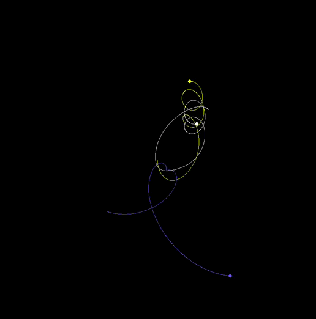
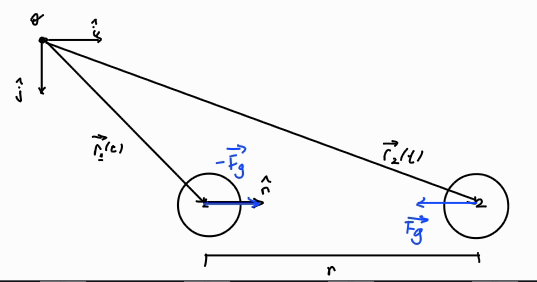
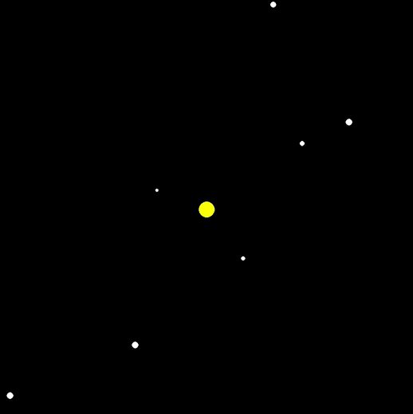

# Gravitação

## Descrição Básica do Projeto
O projeto é uma simulação de interações gravitacionais entre planetas e estrelas no espaço. O propósito é aplicar conceitos da Física para resolver um problema real e verificar esse resultado, usando computação.

### Problema dos $2$ Corpos
Dado dois corpos celestes, interagindo entre si pelas leis da gravitação, como podemos saber a trajetória desses corpos?

A solução mais intuitiva é aquela estudada no curso, em que obtemos explicitamente as equações das trajetórias de ambos os corpos (ver README na pasta ```./Exemplos/Trajetorias``` para mais detalhes nessa solução). Esta é uma solução **analítica**, ou seja, com essas equações conseguimos prever completamente os movimentos no sistema.

### Problema dos $3$ e $N$ Corpos
Mas o que acontece se adicionarmos um terceiro corpo a esse sistema?

Caso a massa desse terceiro corpo seja muito pequena em relação aos outros dois, ainda podemos aproximá-lo a um problema de $2$ corpos (*problema de* $3$ *corpos restrito*). No entanto, caso a massa desses $3$ corpos seja similar, ao tentarmos obter as equações das trajetórias de cada corpo, teremos mais variáveis desconhecidas que equações descrevendo essas variáveis isoladamente.

Em outras palavras, teremos um sistema impossível de equações! Mesmo utilizando o conceito de *centro de massa*, que reduz a quantidade de variáveis desconhecidas, ainda não conseguimos obter uma solução geral para o sistema.

Esse é o problema de $3$ (e, consequentemente) de $N$ corpos. Não conseguimos obter (salvo algumas exceções, em que as condições iniciais permitem que as equações sejam resolvidas, como os casos *Euler* e *Lagrange*) as equações das trajetórias dos corpos a partir das EDO's. Então como saber o comportamento dos corpos nesse sistema?

A solução é aproximar e resolver as equações **numericamente**, calculando iterativamente as forças, acelerações, velocidades e posições de cada corpo conforme eles interagem entre si em pequenos intervalos de tempo. Há múltiplos métodos de simular esse sistema, e o utilizado pos nós foi o mais simples, o **método de Euler**.



## Conceitos de Física e Modelo Matemático
Colocaremos como origem do nosso sistema de coordendas ortonormal um ponto que não é nenhuma das massas. Temos assim um referencial inercial. Seja também o nosso sistema de coordenadas ortonormal dado pelos versores ($\hat{i}, \hat{j}$) ao longo dos eixos ($x, y$), respectivamente.

### Gravitação
Segundo a Lei da Gravitação Universal, a força gravitacional $\vec{F_g}$ entre duas massas $m_1$ e $m_2$, a uma distância $r$ uma da outra é

$$ \begin{align} \vec{F_g} = - \frac{G m_1 m_2}{r^2} \hat{r}, \end{align} $$

onde $G$ é a constante gravitacional. O versor $\hat{r}$ é o vetor unitário que aponta de uma massa para outra:

$$ \begin{align} \hat{r} = \frac{ \vec{r_2} - \vec{r_1} }{\left\| \vec{r_2} - \vec{r_1} \right\|}, \end{align} $$

sendo $r = \left\| \vec{r_2} - \vec{r_1} \right\|$.

Note que $\vec{r_2} = \vec{r_2} (t)$ e $\vec{r_1} = \vec{r_1} (t)$ indicam os vetores posição das massas $2$ e $1$ (respectivamente) no instante $t$ em relação a uma origem.

<p align=center>

</p>

### Leis de Newton
A segunda lei de Newton descreve que a força atuando sobre um corpo $i$ é dada por:

$$ \begin{align} \vec{F_i}(t) &= m_i \vec{a_i}(t). \end{align} $$

Como a única força atuante no sistema é a gravitacional, temos:

<p>
$$ \begin{align} \vec{a_i}(t) &= \dot{\vec{v_i}}(t), \\ \vec{v_i}(t) &= \dot{\vec{r_i}}(t), \\ \ddot{\vec{r_i}}(t) &= \frac{\vec{F_g}}{m_i}. \end{align} $$
</p>

Como discutido anteriormente, é díficil obter a equação explícita de $x(t)$ e $y(t)$ em $\vec{r}(t) = x(t)\hat{i} + y(t)\hat{j}$ com a EDO obtida. Utilizamos, então, o Método de Euler.

### Método de Euler
O método de Euler é um método numérico de aproximar soluções para equações diferenciais. Dado uma função $y(t)$ e um ponto $y(t_0) = y_0$, chamaremos $\frac{d y}{d t} = f(y, t)$. A reta tangente a $t = t_0$ pode ser dada por:

$$ \begin{align} y &= y_0 + f(y_0, t_0) (t - t_0). \end{align} $$

Aplicando essa equação para $t_1$ muito próximo de $t_0$, e $t_2$ muito próximos de $t_1$, temos:

<p>
$$ \begin{align} y_1 &= y_0 + f(y_0, t_0) (t_1 - t_0), \\ y_2 &= y_1 + f(y_1, t_1) (t_2 - t_1). \end{align} $$
</p>

E assim por diante. Generalizando:

<p>
$$ \begin{align} y_{i+1} &= y_i + f(y_i, t_i) (t_{i+1} - t_i), \\ f(y, t)& = \frac{d y}{d t}. \end{align} $$
</p>

Vamos aplicar esse método no nosso caso para obter a velocidade do corpo e, em seguida, sua posição:

1. Para cada corpo $i$, somamos as forças gravitacionais exercidas por todos os outros corpos ($j$):

$$ \begin{align} \vec{F_i} &= - G \sum_{j \neq i} \frac{m_i m_j}{r_{ij}^2} \hat{r_{ij}}. \end{align} $$

2. Calculamos a aceleração do corpo $i$ pela segunda lei de Newton:

$$ \begin{align} \vec{a_i}(t) &= \frac{\vec{F_i}}{m_i}. \end{align} $$

3. Atualizamos a velocidade e a posição do corpo $i$:

<p>
$$ \begin{align} \vec{v_i}(t + \Delta t) &= \vec{a_i}(t) \Delta t + \vec{v_i}(t), \\ \vec{r_i}(t + \Delta t) &= \vec{v_i}(t) \Delta t + \vec{r_i}(t). \end{align} $$
</p>

Note que, em cada um desses passos, temos o valor numérico! É por isso que o método de Euler consegue aproximar bem uma equação diferencial, principalmente na computação: conseguimos obter facilmente o valor da força total, aceleração, velocidade e posição para cada corpo.

#### Por que o Método de Euler?

O método de Euler é o mais simples e fácil de implementar, por isso decidimos implementá-lo em vez de outros métodos como o **método de Vernet** e o **método de Runge-Kutta**. É importante notar, contudo, que para $\Delta t$ muito grandes ou mudanças muito abruptas no comportamento da função, esse método perde sua acurácia. Mas o maior problema desse método é sua **dificuldade em conservar energia** em movimentos circulares/harmônicos, justamente devido ao acúmulo de erros ao decorrer do tempo.

O método de Euler é, na verdade, um caso específico do de Runge-Kutta, que por sua vez usa uma expansão de Taylor de grau maior que $1$. Já o método de Verlet também usa uma expansão de Taylor, mas consegue conservar energias e propriedades geométricas (**simplético**). Ele utiliza a posição atual e passada, além da aceleração atual da partícula, para calcular sua posição, sem ter que calcular a velocidade do corpo a cada passo (como é feito no método de Euler).

## Implementação
### Bibliotecas Usadas
**pygame**: Utilizado para realizar a simulação em si, mostrando as estrelas e os planetas se movendo na tela e processando eventos.

**pygame_gui**: Utilizado para fazer a interface da simulação (sliders e botões).

**math**: Utilizado para cálculos simples como raízes quadradadas.

**random**: Utilizado para gerar condições iniciais aleatórias.

### Parâmetros da Simulação



Podem ser definidos alterando valores dentro do próprio código. Arbitrários.

- **Estrelas/Planetas**
  - Constante gravitacional (G)
  - Raio
  - Cor (RGB)
  - Quantidade (slider)
  - Range de velocidade
  - Range de massa

Valores como a posição e velocidade iniciais em cada eixo de um corpo podem ser manipulados mais especificamente alterando manualmente os valores de cada objeto no código.

- **Janela/Escala**
  - Tamanho da janela do pygame
  - Escala da simulação ("zoom")


## Como Usar

Certifique-se que Python está instalado (versão 3+).

Execute o seguinte comando para baixar as dependências:
```bash
pip install -r requirements.txt
```

Execute o programa:
```bash
python main.py
```

## Referências
(1) Bernardes, E. de S. (2024). Dinâmica-v4 (Notas de aula). 7600105 - Física Básica I. Universidade de São Paulo, São Carlos.

(2) Bernardes, E. de S. (2024). Gravitação (Notas de aula). 7600105 - Física Básica I. Universidade de São Paulo, São Carlos.

(3) Wikipedia. (2024). Problema dos 3 corpos. https://en.wikipedia.org/wiki/Three-body_problem.

(4) Lamar University. (2024). Método de Euler. https://tutorial.math.lamar.edu/classes/de/eulersmethod.aspx.

(5) LibreTexts. (2024). Método de Euler. https://math.libretexts.org/Courses/Monroe_Community_College/MTH_225_Differential_Equations/03%3A_Numerical_Methods/3.01%3A_Euler%27s_Method.

(6) Massachusetts Institute of Technology (MIT). (2024). Método de Runge-Kutta. https://web.mit.edu/10.001/Web/Course_Notes/Differential_Equations_Notes/node5.html.

(7) University of Delaware. (2024). Método de Verlet. https://www.physics.udel.edu/~bnikolic/teaching/phys660/numerical_ode/node5.html.